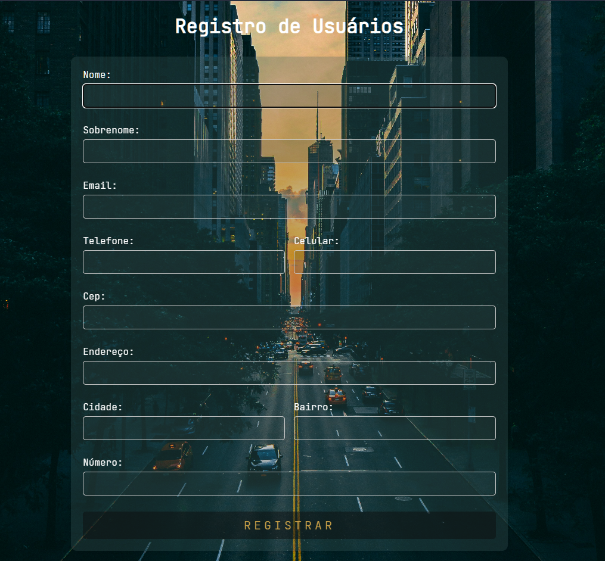

# API de Usuários em PHP

Esta é uma API simples em PHP para cadastro de usuários. Ela oferece uma operação básica de cadastro de usuário.

## Requisitos

- PHP 5.6 ou superior
- Servidor web compatível (Xampp)
- Banco de dados MySQL (ou outro compatível com PDO)

## Instalação

1. Clone o repositório:

   ```bash
   git clone https://github.com/seu-usuario/seu-repositorio.git
   ```

2. Configure o banco de dados editando o arquivo `src/config/database.php` com suas credenciais.

3. Certifique-se de que seu servidor web pode acessar o diretório raiz do projeto.

## Uso

- **GET /users.php**: Retorna todos os usuários cadastrados.

  Exemplo de requisição:

  ```bash
  curl -X GET http://seu-domínio.com/api/users.php
  ```

  Exemplo de resposta:

  ```json
  {
    "records": [
      {
        "id": 1,
        "nome": "João",
        "sobrenome": "Silva",
        "email": "joao@example.com",
        "telefone": "123456789",
        "celular": "987654321",
        "cep": "12345-678",
        "endereco": "Rua das Flores",
        "cidade": "São Paulo",
        "bairro": "Centro",
        "numero": "100"
      },
      {
        "id": 2,
        "nome": "Maria",
        "sobrenome": "Santos",
        "email": "maria@example.com",
        "telefone": "987654321",
        "celular": "123456789",
        "cep": "54321-876",
        "endereco": "Avenida Brasil",
        "cidade": "Rio de Janeiro",
        "bairro": "Copacabana",
        "numero": "200"
      }
    ]
  }
  ```

- **Outros métodos**: Métodos não permitidos retornam um código de status HTTP 405 (Method Not Allowed).
---

